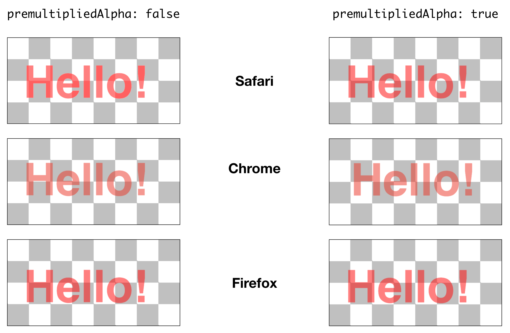

# WebGL: Transparency with premultipliedAlpha

Using `premultipliedAlpha = true` to get smooth edges in Safari.

## Acknowledgements

Some of the WebGL plumbing code is based on https://github.com/tehmou/WebGL-from-Scratch.